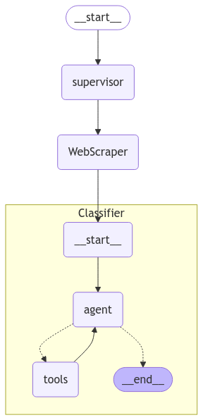
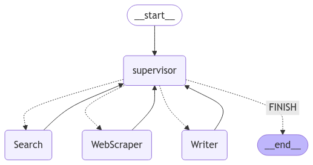
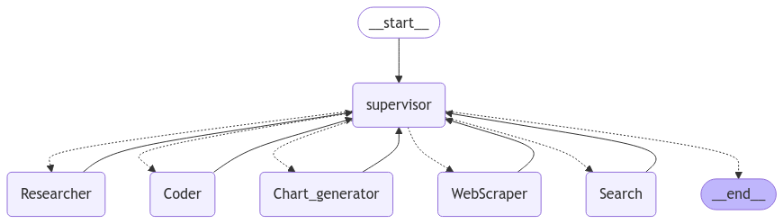

# LangGraph Multi-Agent System for Article Classification and Analysis

This repository contains a collection of Jupyter notebooks that implement a multi-agent system for classifying, analyzing, and visualizing web content, with a focus on financial and cryptocurrency data. The system uses LangGraph and is inspired by the AutoGen paper on multi-agent architectures for LLM applications.

## Notebooks Overview

### 1. Slack WebScraper Classifier (`articles_classifier_agents/slack_webcraper_classifier.ipynb`)
This notebook implements a system to:
- Extract links shared in Slack channels using the Slack Web API
- Filter and process URLs, excluding internal links
- Implement a multi-agent classification system for web articles
- Use Tavily search for enhanced web content analysis
- Process and structure the extracted content for further analysis

### 2. Writer Agents (`writer_agent/writer_agents.ipynb`)
This notebook implements a hierarchical agent system that:
- Creates a research assistant with multiple specialized agents
- Implements a hierarchical structure with top-level and mid-level supervisors
- Processes research queries and generates comprehensive reports
- Demonstrates the use of multi-agent conversation patterns
- Handles complex research tasks through agent collaboration

### 3. Chart Generator (`chart_generator_agents/chart_generator.ipynb`)
This notebook focuses on financial data visualization:
- Fetches financial data using Yahoo Finance API
- Implements tools for company information retrieval
- Creates visualization agents for financial data
- Generates radar charts and other visualizations for comparative analysis
- Specializes in cryptocurrency market analysis and visualization

## Key Features

- **Multi-Agent Architecture**: Implements a sophisticated system of cooperating agents
- **Hierarchical Organization**: Uses supervisor nodes to manage complex tasks
- **Data Processing**: Handles web scraping, financial data, and content analysis
- **Visualization**: Creates professional-grade financial charts and graphs
- **Modular Design**: Each notebook focuses on specific functionality while maintaining interoperability

## Requirements

The system requires several Python packages:
- langgraph
- langchain
- langchain_openai
- langchain_experimental
- pandas
- matplotlib
- slack_sdk
- beautifulsoup4
- yahoofinance

## Environment Setup

You'll need to set up the following environment variables: 
